# Instagram Reels-Style Low-Buffering Architecture

## End-to-end flow

```mermaid
flowchart LR
A["User opens Reels feed"] --> B["Feed API returns ranked reel IDs + metadata + playback URLs"]
B --> C["App starts Reel N immediately (low/medium bitrate)"]
C --> D["App prefetches Reel N+1 and N+2 first segments"]
D --> E["Player monitors bandwidth + buffer + device performance"]
E --> F{"ABR decision engine"}
F -->|"Good network"| G["Switch up to higher bitrate chunks"]
F -->|"Weak/unstable network"| H["Stay/lower bitrate to avoid stall"]
G --> I["Continuous chunk fetch from nearest CDN edge"]
H --> I
I --> J{"CDN cache hit?"}
J -->|"Yes"| K["Serve from edge (very low latency)"]
J -->|"No"| L["Fetch from origin storage, then cache at edge"]
K --> M["App decode (hardware) + render smooth playback"]
L --> M
M --> N["Playback analytics: startup time, rebuffer ratio, watch time"]
N --> O["Backend updates ranking + prefetch strategy"]
O --> B
```

## Build order (practical)

1. Implement chunked streaming with ABR manifests (HLS/DASH + multiple bitrates).
2. Put a CDN in front of media origin and configure aggressive edge caching.
3. Add client-side prefetch for next 1-2 videos; cancel stale prefetch on fast scroll.
4. Start playback at safe bitrate, then ramp quality up when buffer/network are stable.
5. Track QoE metrics: startup delay, rebuffer count, completion rate, bitrate switch count.
6. Tune initial bitrate and prefetch size using production telemetry.
